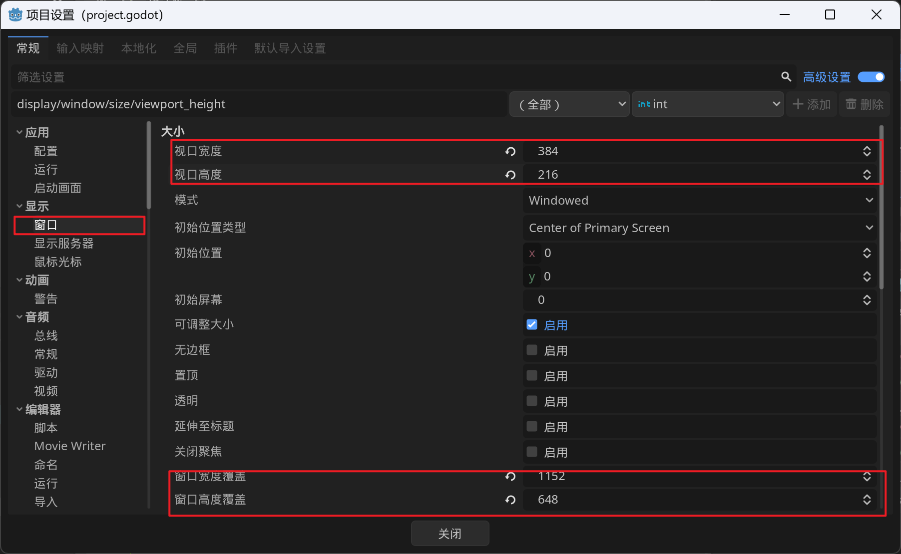
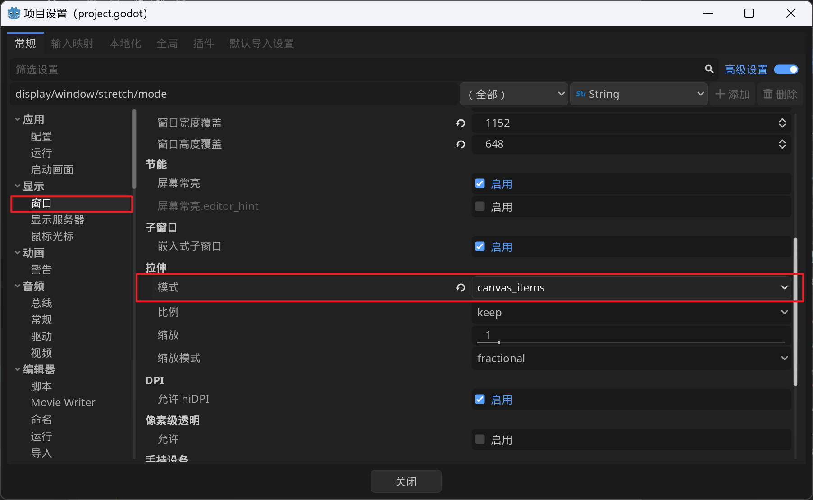
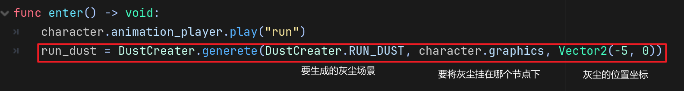
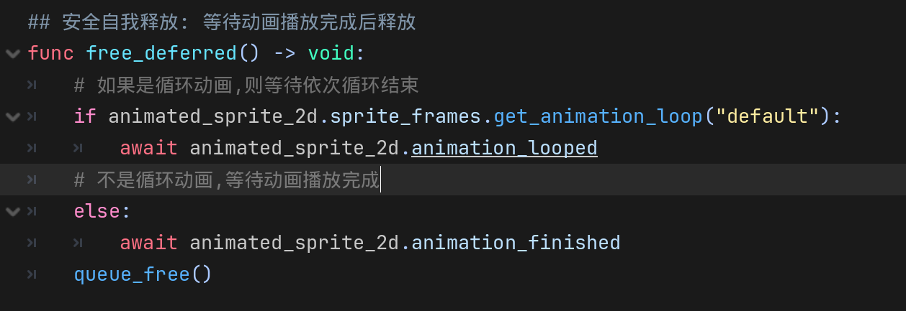
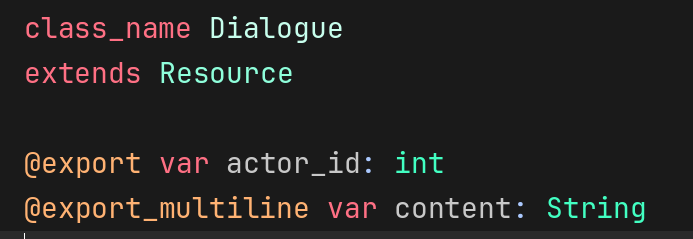
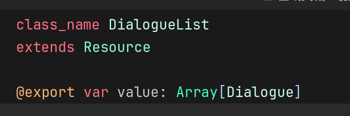
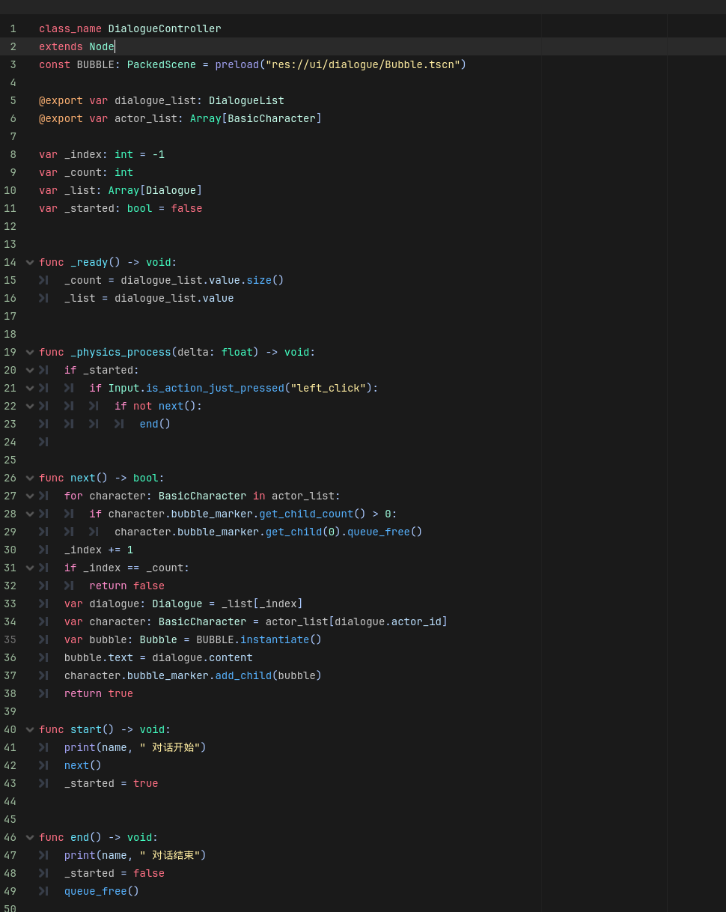

# Treasure-Hunter

## 目录结构

- `assets`: 存放艺术资源
  - `graphics`: 图形艺术资源
    - `character`: 角色
    - `map`: 地图
    - `particle`: 灰尘
    - `tileset`: tileset资源

- `component`: 组件,给某个节点赋予一个功能
  - `direction`: 方向组件
  - `state_machine`: 状态机组件
  - `camera`: 相机组件
- `character`: 逻辑上的游戏角色
  - `captain_clown_nose`: 游戏主角,小丑鼻子
- `entity`: 逻辑上的游戏物品
  - `interactable`: 可互动实体
  - `stuff`: 不可互动实体
    - `dust`: 角色运动时生成的灰尘
    - `formap`: 地图上的装饰实体
      - `island`: 棕榈树岛
        - `palm`: 棕榈树
        - `water_reflect`: 水面反射波纹
- `resource`: 资源
  - `sprite_frames`: 帧动画资源
  - `story`: 对话剧情资源
  - `tileset`: tileset资源

- `scene`: 游戏世界场景,关卡
  - `common`: 通用场景资源
  - `palm_tree_island`: 棕榈树岛

- `system`: 游戏系统
  - `dialogue`: 对话系统

- `ui`
  - `bubble`: 对话气泡ui

- `docs`: 说明文档

## 项目设置

### 基础设置

首先开启高级设置选项,此选项会开放更多的设置内容

2d像素游戏中,需要修改纹理过滤方式为`Nearest`, 以便得到清晰的像素图形

调整窗口大小以及画面缩放比例

窗口高度/宽度覆盖表示固定窗口的尺寸的大小

视口高度/宽度表示实际显示的游戏游戏画面的大小,这里将视口宽高设为窗口宽高的1/3

然后将画面拉伸模式设为`canvas_items`:  将游戏画面拉伸至覆盖整个屏幕

最终效果就是游戏画面放大3倍显示

### 输入映射

略

## 时间线

- [x] 创建角色`captain_clown_nose`

  - 状态机组件实现, 实现idle, run, jump, fall状态

  - 方向组件实现
- [x] 实现角色运动中产生的灰尘

  - `dust_creater`: 灰尘创建者

  - `run_dust`, `fall_dust`, `jump_dust`: 具体的灰尘场景
- [x] 创建`palm_tree_island`初实现

  - tilemap

  - 视差背景

  - 地图装饰物: tree
- [x] 实现`camera`组件
- [x] 对话框气泡ui实现
  - ui初实现
- [x] 对话管理系统
  - 对话资源
  - 对话列表资源
  - 对话控制器
- [x] 细节完善: 添加koyote jump
  - 在Captain_Fall中添加逻辑
- [x] 添加一个新角色 Bomb Guy
  - 实现基础移动功能
- [ ] 创建可交互类
  - 可推动的箱子

## 详解

### Dust

角色运动时产生的灰尘

**1.结构:**`/entity/stuff/dust`

- `dust_creater.gd`:
  - `generete(dust_scene, parent, pos) -> Dust:`: 生成指定的灰尘场景
- `run_dust.tscn`: 奔跑灰尘场景
- `fall_dust.tscn`: 降落灰尘场景
- `jump_dust.tscn`: 起跳灰尘场景

**2. 生成灰尘流程**

以奔跑灰尘举例:

进入run状态后,调用`dust_creater`的`generate`方法在指定父节点的指定位置生成灰尘

在退出run状态时,调用灰尘的`free_defeered`方法,等待当前灰尘播放完动画后自我释放

### 对话系统

单个对话资源, 包含讲话者id,以及讲话内容 

对话列表资源, 包含一组对话

对话控制器, 控制一组对话的进行

对话资源中的actor_id与这里的actor_list中的下标一一对应

next方法: 创建一个bubble气泡,填入dialogue的content, 挂在指定角色的bubble_maker节点下

